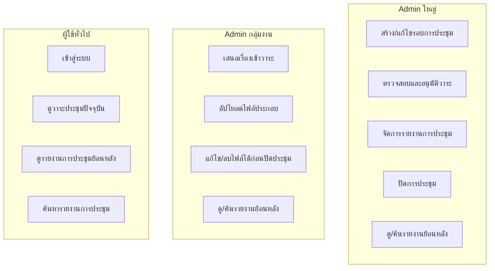
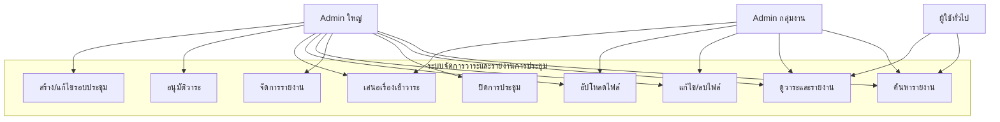
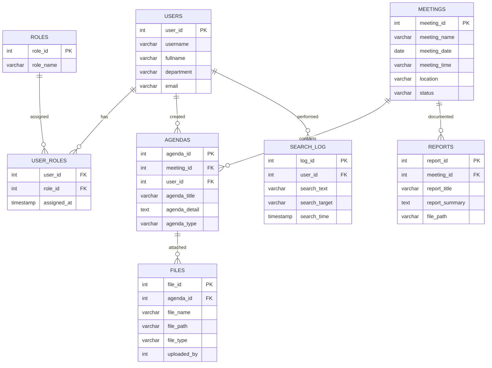

# ระบบจัดการวาระและรายงานการประชุม (Meeting Management System)
**Version:** 3.3  
**สถานะ:** Stable  
**จัดทำโดย:** กลุ่มงานสุขภาพดิจิทัล โรงพยาบาลลี้  
**ประเภทเอกสาร:** Master Specification  
**ครอบคลุม:** Conceptual → Logical → Physical → PRD → Tech Stack  

---

## 1. แนวคิดหลักของระบบ
เจ้าหน้าที่แต่ละกลุ่มงานจะเข้าสู่ระบบ (Login) เพื่อดูวาระการประชุมครั้งปัจจุบัน (Current Meeting Agenda)  
และรายงานการประชุมครั้งที่ผ่านมา (Meeting Report History) หากกลุ่มงานของตนมีวาระที่จะนำเสนอ  
สามารถอัปโหลดเอกสารประกอบได้ เช่น PDF, DOCX, XLSX, PNG, JPEG, TXT เป็นต้น

---

## 2. Requirement เบื้องต้น
1. เจ้าหน้าที่ทุกกลุ่มงานสามารถเข้าดูรายงานการประชุมได้  
2. หากมีเรื่องเสนอ สามารถเพิ่มเรื่องใหม่ได้ไม่จำกัด พร้อมแนบไฟล์ประกอบ  
3. ระบุประเภทของเรื่องได้ เช่น เพื่อทราบ / เพื่อพิจารณา / เพื่อสั่งการ  
4. ดูรายงานการประชุมย้อนหลังได้ทุกครั้ง  
5. ค้นหารายงานการประชุมด้วยคำ (FreeText Search) จากทุกการประชุมได้  
6. ใช้งานเฉพาะภายในเครือข่ายของหน่วยงาน (LAN / VPN)  
7. แก้ไขหรือลบเอกสารได้จนกว่าจะปิดการประชุมนั้น ๆ  

---

## 3. บทบาทผู้ใช้ (User Roles)
| บทบาท | สิทธิ์หลัก |
|--------|-------------|
| Admin ใหญ่ | สร้าง/จัดการรอบการประชุม ตรวจสอบ อนุมัติ ปิดการประชุม ดู/ค้นรายงานทั้งหมด |
| Admin กลุ่มงาน | เสนอเรื่องเข้าวาระ อัปโหลด/แก้ไขไฟล์ก่อนปิดประชุม ดู/ค้นรายงานได้ |
| ผู้ใช้ทั่วไป | เข้าดูวาระประชุม ดูรายงานย้อนหลัง และค้นหารายงานได้ |

---

## 4. System Flow (Vertical Role-Based)

---

## 5. Use Case Diagram

---

## 6. ER Diagram (v3.3)

---

## 7. เอกสาร PRD (Product Requirement Document)
รวมเนื้อหา PRD v1.0 ไว้เต็มฉบับ  
- ระบบตรวจสอบ login จาก MariaDB.users (MD5)  
- โหลดสิทธิ์จาก PostgreSQL.user_roles  
- แสดง Dashboard การประชุมล่าสุด  
- เสนอเรื่องเข้าวาระ, แนบไฟล์, แก้ไข/ลบก่อนปิดประชุม  
- จัดการรายงาน, ปิดรอบประชุม, ค้นหาแบบ FreeText  
- มี Search Log เก็บพฤติกรรมการค้นหาและ login  

**Non-Functional Requirement:**  
- รองรับ 50 concurrent users  
- read-only DB connections  
- รองรับ offline mode (MariaDB down ชั่วคราว)  
- Logging ครบทุกกิจกรรม  
- สำรองข้อมูลอัตโนมัติผ่าน cron  

**Roles & Permissions:**  
| กิจกรรม | Admin ใหญ่ | Admin กลุ่มงาน | ผู้ใช้ทั่วไป |
|----------|-------------|-----------------|---------------|
| เข้าสู่ระบบ | ✅ | ✅ | ✅ |
| ดูวาระประชุม | ✅ | ✅ | ✅ |
| เสนอเรื่อง | ✅ | ✅ | ❌ |
| อัปโหลดไฟล์ | ✅ | ✅ | ❌ |
| แก้ไข/ลบ | ✅ | ✅ (ก่อนปิด) | ❌ |
| ปิดรอบประชุม | ✅ | ❌ | ❌ |
| จัดการรายงาน | ✅ | ❌ | ❌ |
| ค้นหา | ✅ | ✅ | ✅ |

---

## 8. Tech Stack (ฉบับเต็ม)
**Backend:** FastAPI (Python 3.11), SQLAlchemy, Uvicorn, psycopg2, pymysql  
**Frontend:** Vue.js 3 + TailwindCSS + Axios  
**Database:** PostgreSQL 17 (หลัก), MariaDB 11 (Auth)  
**Deployment:** Docker Compose / Physical Server  
**Security:** MD5 auth check, HTTPS (Nginx), RBAC Middleware  
**Structure:** models / routes / services / schemas / utils  
**API Prefix:** `/api/v1/`  
**Testing:** pytest, flake8  
**Backup:** pg_dump + cron job  
**Volume Path:** `/uploads/<year>/<meeting_id>/`  

---

## 9. การติดตั้งระบบบนเครื่องจริง
1. ติดตั้ง PostgreSQL และ MariaDB  
2. ตั้งฐานข้อมูล meeting_mgmt / authdb  
3. ติดตั้ง FastAPI และ dependencies  
4. รัน backend ด้วย Uvicorn  
5. ติดตั้ง Vue.js และ build frontend  
6. ตั้งค่า Nginx reverse proxy  
7. ทดสอบระบบผ่าน LAN  

---

## 10. สรุป
ระบบนี้ออกแบบเพื่อให้หน่วยงานสามารถบริหารวาระการประชุมได้แบบรวมศูนย์  
รองรับการอัปโหลดไฟล์ การบันทึกการประชุมย้อนหลัง และการค้นหาด้วยคำสำคัญ  
ใช้เทคโนโลยีโอเพนซอร์สทั้งหมดและพร้อมต่อยอดสู่ Container Deployment ได้ในอนาคต
